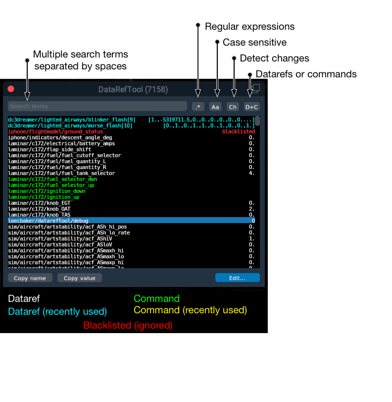

# Data Ref Tool for X-Plane plugin development
**[Download from GitHub](https://github.com/leecbaker/datareftool/releases)**

DRT is an X-plane plugin intended to replacement for Sandy Barbour's Data Ref Editor (DRE). While the core functionality is much the same, many features are improved to make the experience nicer:

* Case insensitive search option
* Regex search option
* Only show datarefs that have changed recently
* Easier to deselect the search field
* Better display of array data

DRT is a work in progress; code contributions are welcome.

### License
DRT is available under the MIT license. See the LICENSE file for more details.

### Feature list

* Read, write, and search for datarefs
* Search for and execute commands
* Case insensitive search
* Regex search
* Windows, Mac, Linux are all supported
* Filter only recently changed datarefs, and color datarefs that recently changed
* Displays all data types
* Display multiple elements of an array at once
* Make it easy to deselect the search field (unlike DRE). Use enter, return, escape, or tab, or click elsewhere in the DRT window.
* Cut/copy/paste/select all in search field and for datarefs (uses standard keyboard shortcuts)
* Multiple DRT windows viewable at once

### How to build
Building requires cmake and a c++11 compiler. Here's how I do it:

    mkdir build
    cd build && cmake ..
    make

#### Building on Windows
Boost is now required, which complicates the build a bit. If you don't have the required paths set up I'd recommend looking at my [personal build script](build_win.bat).

On Windows, you can use the Visual Studio project generator to do something like this:

    mkdir build
    cd build && cmake -G "Visual Studio 12 Win64" -DMSVC_RUNTIME=dynamic ..

at which point you can just use Visual Studio to build the project, or you can build on the command line:

    msbuild src/plugin.vcxproj /p:Configuration=Release /flp:logfile=plugin_build.log;verbosity=normal

Note: You no longer need the VC++ CTP compiler to build DRT.

#### Building on Linux
On Linux, you'll need a couple of packages that you might not have. This worked for me:

	sudo apt-get install libx11-dev libboost-all-dev

### Adding custom datarefs
You can use DRT to display your plugin's custom datarefs. Just send a message of type 0x01000000 with a pointer to the name of the dataref as the payload. There is an example of how to do this in [plugin_custom_dataref.cpp](src/plugin_custom_dataref.cpp). (This is exactly the same method that you use to add a custom dataref to Data Ref Editor.)

### FAQ: What are the keyboard shortcuts?
Glad you asked!

* Ctrl-X / &#8984;-X : cut
* Ctrl-C / &#8984;-C : copy
* Ctrl-V / &#8984;-V : paste
* Ctrl-N / &#8984;-N : new window (only works when a text field or search field is selected)
* Ctrl-W / &#8984;-W : close current window (only works when a text field or search field is selected)

### FAQ: DRT can't find my dataref!
DRT scans files to find datarefs. This might not work if your dataref is in an encrypted Lua file or something, so you have several options:

* If this is an aircraft, add a file called "dataref.txt" inside your aircraft directory with a list of datarefs and commands, one on each line
* Have your plugin send DRT a message with as described above in "Adding custom datarefs"
* Turn on "Impersonate DataRefEditor" on the plugin menu inside X-Plane. Before you do this, ensure that the DataRefEditor plugin is not installed. This way, X-Plane itself will tell DRT about all datarefs it knows about.

### FAQ: Using DRT causes X-Plane to crash!
I don't always know why DRT causes X-Plane to crash, but here's are common causes:

* DRT reads every dataref published by every aircraft and plugin, on every frame of the simulation. Sometimes, they haven't fully been debugged, and may crash. (If you're a developer, the best way to do this is to run X-Plane in a debugger and look at the backtrace of the crash- if you see RefRecords::update() in the backtrace, this is likely what happened.)

  If you can figure out which dataref caused the crash, the best way to work around this is to add the name of the dataref to a file called "drt_blacklist.txt" in the Resources/plugins directory. This will cause DRT to never read the value of the dataref, even if it does come up in search results.

* Other causes TBD.

### Author
DRT is written by Lee C. Baker. If you benefitted from this plugin, please consider purchasing the <a href="https://planecommand.com">PlaneCommand voice recognition plugin.

&copy; 2017-2018 Lee C. Baker.